# CarbonFit

An Application that lets you calculate your Carbon Footprint, get Alternatives on how to reduce your carbon emission, Offset your Carbon Emission and talk to Ember-the AI Chatbot.

## Tech Stack

**Client:** Flutter

**Server:** NodeJs, Express, Flask

**Chatbot:** Pytorch (Python)

**Web-Scraping:** BeautifulSoup (Python)

## What is this project about?

* Carbon Footprint is the amount of greenhouse gases(in tons) released into the atmosphere due to our actions. These gases mainly include carbon dioxide and methane.
* Carbon footprint is affected by various factors like electricity consumption, fuel consumption, e-waste, transport preferences etc.
* We aim at providing an application to calculate the footprint of an individual and also providing them solutions to reduce the same.

## App Demo
The demo video can be found on the following link: 
[CarbonFit](https://drive.google.com/file/d/1lll0pWS4P3_3RBDDm09UDg4dygN7yMT3/view?usp=sharing)

## Screenshots

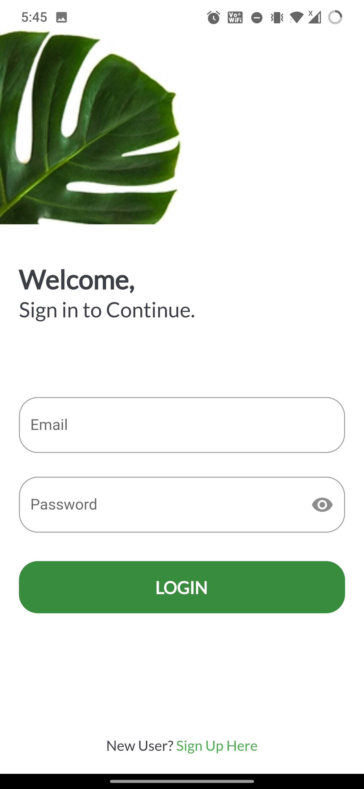
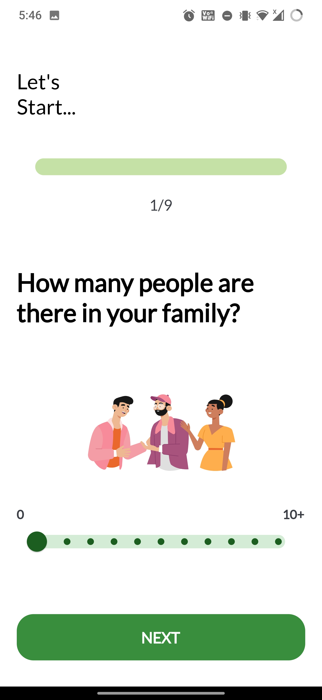
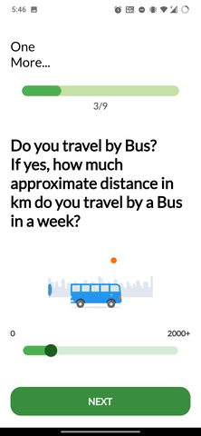

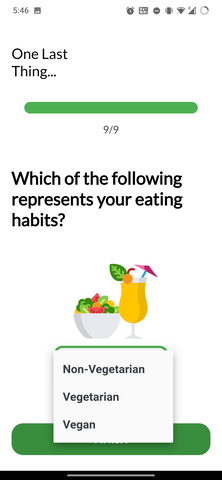
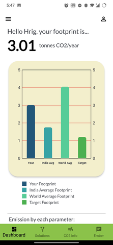
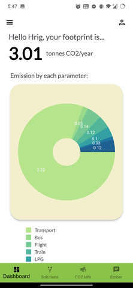
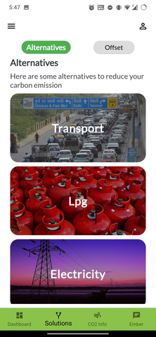
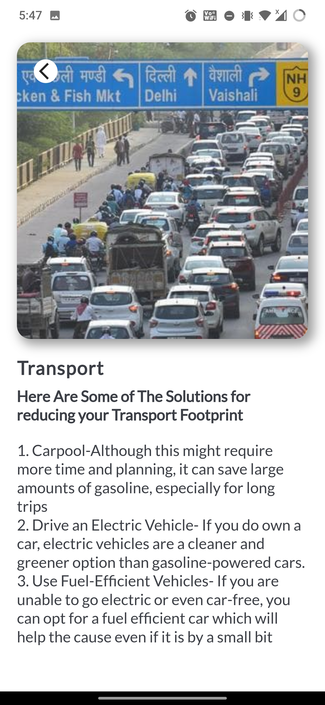
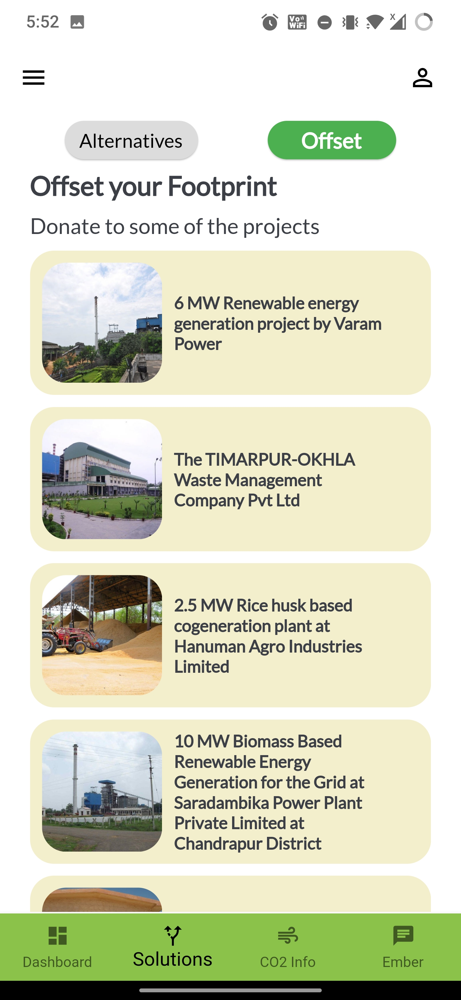

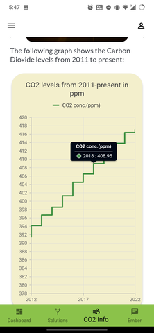
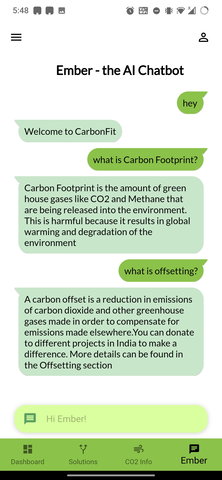

